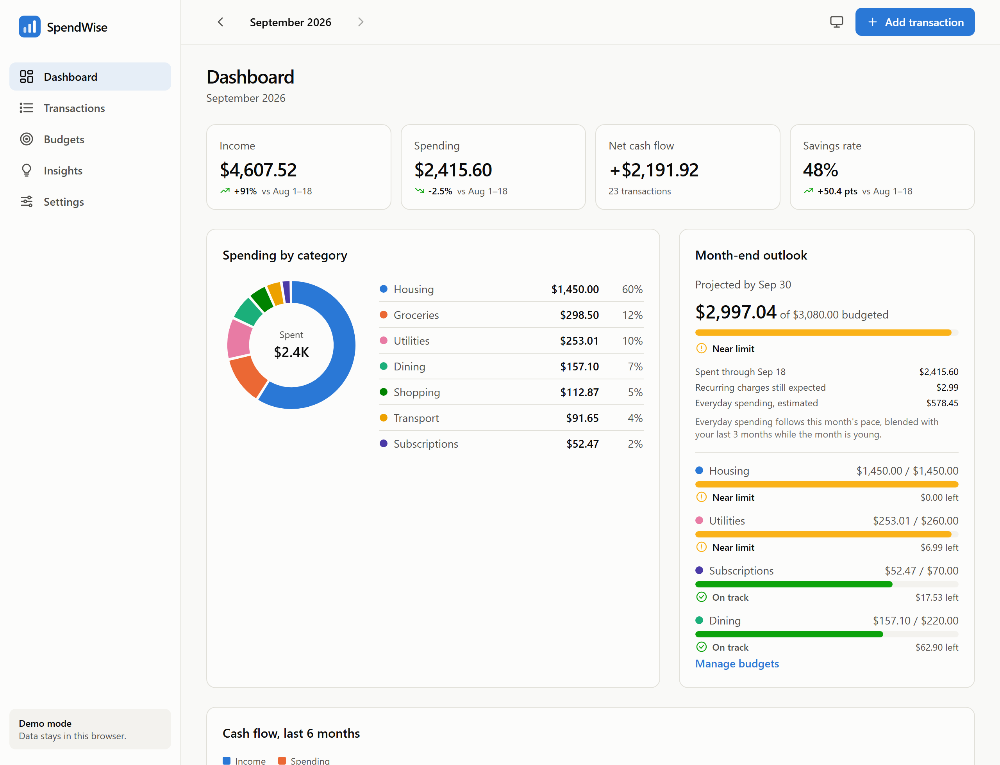
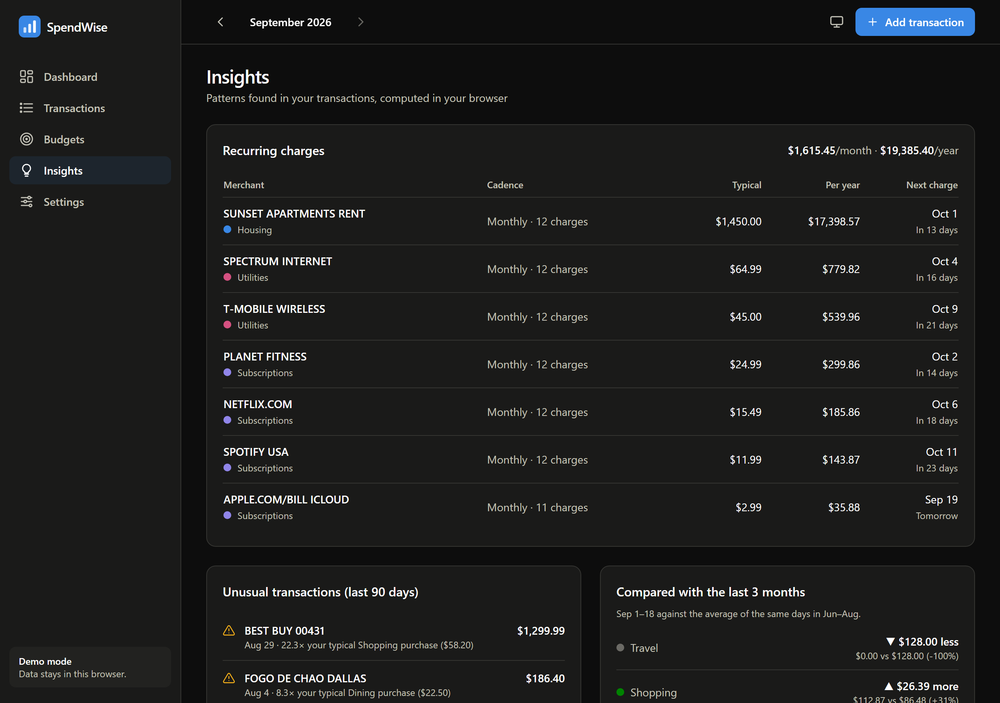
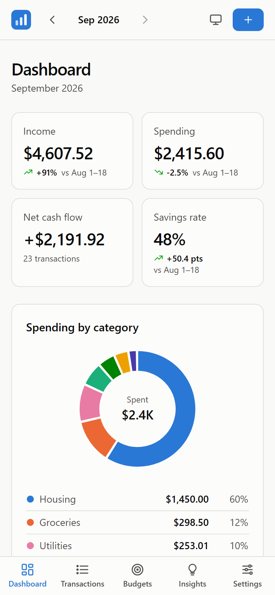

# SpendWise

[](https://github.com/HermosuraM/spendwise/actions/workflows/deploy.yml)


A local-first budgeting app that explains your spending: it finds recurring charges, flags unusual purchases
and forecasts where the month will end, using plain statistics that are spelled out next to every number.
Data stays in the browser by default; an optional Supabase backend adds sign-in and sync across devices.

**[Live demo](https://hermosuram.github.io/spendwise/)**: loads twelve months of realistic sample data, no sign-up.



<p align="center">
  
  &nbsp;
  
</p>

## Features

- **Dashboard**: income, spending, net cash flow and savings rate, each compared like-for-like (Sep 1–18 vs. Aug 1–18,
  not against a whole month); spending by category; a month-end forecast against your budgets; six months of cash flow.
- **Transactions**: search, filter and sort; CSV import that understands typical bank exports (signed amounts,
  MM/DD/YYYY dates, "Payee"/"Memo" columns) and reports bad rows by line number; CSV export.
- **Budgets**: monthly limits per category that carry forward until changed, with clear "On track / Near limit /
  Over budget" states; custom categories.
- **Insights**: recurring charges with cadence, next charge and yearly cost; unusual purchases; category changes
  against the last three months; a "How these are computed" card in plain language.
- **Local-first**: works offline in `localStorage` with versioned storage, JSON backup and a memory fallback when
  storage is blocked. Optional Supabase sync with row-level security.
- **Accessible**: labelled controls, keyboard and focus handling in dialogs, a table view for every chart, status
  never shown by color alone, and a color-vision-deficiency-safe palette with a separately tuned dark theme.

## How the insights work

Every insight is a few lines of statistics in [`src/lib/insights.js`](src/lib/insights.js), so each flag can be explained in a sentence.

**Merchant normalization.** Card descriptors are noisy (`NETFLIX.COM 866-579-7172`, `SQ *TACO DELI`, `H-E-B #482`).
Processor prefixes, domains, store numbers and order codes are stripped so repeat purchases group together.

**Recurring charges.** For each merchant with 3+ charges, the median gap between charges picks a cadence (weekly,
biweekly, monthly, quarterly, yearly); at least 75% of gaps must fit it and every amount must be within 15% of the
median. Monthly and longer cadences step by calendar month, so rent paid on the 1st is next due on the 1st rather
than 30.44 days later. A charge that misses two cycles is treated as cancelled.

**Unusual purchases.** Each purchase gets a modified z-score (Iglewicz & Hoaglin) on log(amount) against the past year of
its category:

```math
z = \frac{0.6745\,(\ln x - \operatorname{median})}{\operatorname{MAD}}
```

Purchases from the last 90 days with z > 3.5 are flagged. The median and median absolute deviation are robust, so one
earlier splurge cannot hide the next one, and recurring merchants are excluded (rent is large but expected).

**Month-end forecast.**

```math
\text{projected} = \text{spent so far} + \text{recurring charges still expected} + \text{days left} \times \big(w \cdot \text{pace} + (1 - w) \cdot \text{baseline}\big)
```

Here *pace* is this month's everyday (non-recurring) spending per day, *baseline* is the median daily rate of the
previous three months, and *w* is the share of the month that has passed. Early in the month the forecast leans on
history, so a \$300 purchase on the 2nd isn't multiplied by 30; by month-end it follows the month itself.

**Fair comparisons.** A month in progress is always compared with the same days of earlier months, never with whole months.

## Architecture

```
src/
  lib/          pure, tested logic: money (integer cents), dates, CSV, analytics, insights, sample data
  data/         storage behind one async interface: localStorage and Supabase repositories
  state/        React context for data, preferences and session; picks the backend
  components/   UI kit, charts (Recharts), transaction form and dialogs
  pages/        Dashboard, Transactions, Budgets, Insights, Settings
supabase/schema.sql   tables, constraints and row-level security policies
```

- **Money is integer cents** end to end, so totals never drift.
- **Repository pattern**: pages call `actions.addTransactions(...)` and never know which backend is active. Failed
  saves surface as a toast and keep the form open.
- **Supabase is loaded only when configured** (dynamic import), so the demo bundle never downloads it.
- **Hash routing** keeps deep links working on GitHub Pages, which has no single-page-app fallback.
- **Charts follow a fixed 8-color categorical palette**; extra categories fold into "Other" instead of generating new colors.

## Run it locally

```bash
npm install
npm run dev
```

| Command | What it does |
| --- | --- |
| `npm run dev` | Dev server at http://localhost:5173 |
| `npm test` | Vitest suite (66 tests) |
| `npm run lint` | ESLint |
| `npm run build` | Production build in `dist/` |

The tests cover the statistics with hand-computed cases (including regressions such as rent being double-counted in
the forecast), CSV parsing and round-trips, both repositories (Supabase through a fake query builder), the
transaction form, and full app flows with Testing Library.

In development, add `?today=2026-09-18` to the URL to see the app as of another date (clear site data first so the
sample regenerates). The override is stripped from production builds.

## Optional: sync with Supabase

1. Create a project at [supabase.com](https://supabase.com) and run [`supabase/schema.sql`](supabase/schema.sql) in the SQL editor.
2. Copy `.env.example` to `.env.local` and set `VITE_SUPABASE_URL` and `VITE_SUPABASE_ANON_KEY` (Project Settings → API).
3. Restart `npm run dev`. SpendWise switches to email sign-in; every row is scoped to its owner by row-level security,
   so the public anon key is safe in the browser. "Try the demo" on the sign-in screen still opens local mode.

## Deployment

[`.github/workflows/deploy.yml`](.github/workflows/deploy.yml) lints, tests and builds every push and pull request, and
deploys `main` to GitHub Pages (built with `VITE_BASE=/spendwise/`).

## Tech

React 19, React Router 7, Vite 8, Tailwind CSS 3, Recharts 3, Supabase JS 2, Vitest 5 with Testing Library and jsdom, ESLint 10.

## License

[MIT](LICENSE)
